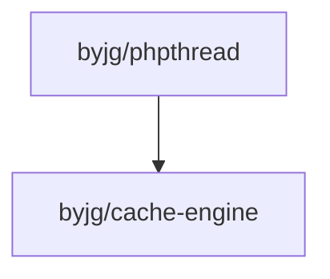

# ByJG PHPThread: Simplified Threads and Non-Blocking Code in PHP

[](https://github.com/byjg/php-phpthread/actions/workflows/phpunit.yml)
[](http://opensource.byjg.com)
[](https://github.com/byjg/php-phpthread/)
[](https://opensource.byjg.com/opensource/licensing.html)
[](https://github.com/byjg/php-phpthread/releases/)

ByJG PHPThread simplifies working with threads and non-blocking code in PHP,
bridging the gap for a language that was not inherently designed for threading.

---

## Table of Contents

1. [Overview](#overview)
2. [Why Threads in PHP?](#why-threads-in-php)
3. [How It Works](#how-it-works)
   - [Default PHP (Non-ZTS)](#default-php-non-zts)
   - [PHP ZTS (Zend Thread Safety)](#php-zts-zend-thread-safety)
4. [Features](#features)
5. [Limitations](#limitations)
6. [Installation](#installation)
7. [Dependencies](#dependencies)

---

## Overview

PHPThread is a polyfill library that abstracts threading functionality for PHP, providing a consistent
interface regardless of the underlying PHP setup (ZTS or Fork). It empowers developers to implement
thread-like behavior and asynchronous processing in PHP applications.

---

## Why Threads in PHP?

PHP is traditionally designed for a **request-response cycle**, where scripts are executed
only in response to client requests and terminate after sending a response. While efficient for
web applications, this architecture lacks native threading support for background or concurrent tasks.

With PHPThread, you can overcome these limitations by leveraging:

- **Forking (Default PHP)** for simulating threading.
- **Zend Thread Safety (ZTS)** for true multi-threading environments.

---

## How It Works

### Default PHP (Non-ZTS)

In standard PHP installations (without ZTS), threading is simulated using the `fork` command.
This approach creates a new process by cloning the parent process. While not a true thread,
this method can approximate threading behavior.

**Requirements:**

- [pcntl](https://www.php.net/manual/en/book.pcntl.php): For process control.
- [shmop](https://www.php.net/manual/en/book.shmop.php): For shared memory.

---

### PHP ZTS (Zend Thread Safety)

With ZTS-enabled PHP, true multi-threading becomes possible. This setup is ideal for production environments where
robust threading is required. The ZTS version is compiled with the `--enable-zts` flag, but it may not be included in
all PHP distributions.

**Requirements:**

- [parallel](https://www.php.net/manual/en/book.parallel.php): For multi-threading functionality.
- [shmop](https://www.php.net/manual/en/book.shmop.php): For memory sharing.

---

## Features

- **Thread Management**: Simplified thread creation and execution ([docs](docs/thread.md)).
- **Thread Pools**: Efficiently manage and reuse threads for multiple tasks ([docs](docs/threadpool.md)).
- **Promises**: Truly asynchronous and non-blocking task management with a JavaScript-like Promise API ([docs](docs/promises.md), [benchmark](docs/promises-benchmark.md)).

Supported Promise Methods:

- `then()`: Execute a callback on promise resolution.
- `catch()`: Execute a callback on promise rejection.
- `finally()`: Execute a callback after resolution or rejection.
- `Promise::resolve()`: Resolve a promise.
- `Promise::reject()`: Reject a promise.
- `Promise::all()`: Wait for all promises to resolve.
- `Promise::race()`: Wait for the first promise to resolve.

---

## Limitations

### Forking and Data Sharing

When simulating threads with `fork`, data cannot be returned directly from the child process
to the parent. Use the `shmop` extension to share memory between processes.

However:

- **Avoid returning large or complex objects**, as this may cause memory exhaustion.

---

## Installation

### Requirements

#### Non-ZTS (Default PHP)

- PHP ≥8.1
- `pcntl` extension
- `shmop` extension

#### ZTS (Zend Thread Safety)

- PHP ≥8.1 compiled with `--enable-zts`
- `parallel` extension
- `shmop` extension (for Promises support)

### Install via Composer

```bash
composer require byjg/phpthread
```

---

## Dependencies



----
[Open source ByJG](http://opensource.byjg.com)
