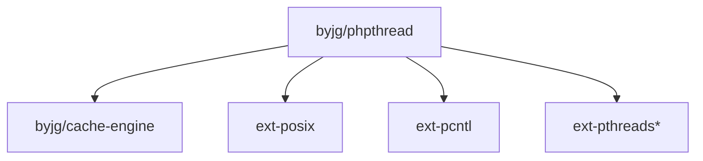

# phpthread

[](http://opensource.byjg.com)
[](https://scrutinizer-ci.com/g/byjg/phpthread/?branch=master)
[](https://scrutinizer-ci.com/g/byjg/phpthread/?branch=master)
[](https://github.com/byjg/phpthread/actions/workflows/phpunit.yml)

Polyfill Implementation of Threads in PHP. This class supports both FORK process and native Threads using ZTS compilation;

This class detects automatically if PHP was compiled:

- with ZTS (--enable-maintainer-zts or --enable-zts) and the extension pthreads (works on Windows also) 
- with the Process Controle (--enable-pcntl)

and choose the most suitable handler for processing the threads. The thread interface is the same whatever is the Thread handler.

## Notes

- Most of the fork implementation was based on the post "http://villavu.com/forum/showthread.php?t=73623" by the "superuser"
- Tales Santos (tsantos84) contributed on the base of the Thread ZTS by creating the code base and solving some specific thread problems. Thanks!!!!  

## Usage

Assume for the examples below the class 'Foo' and the method 'bar':

```php
require_once('vendor/autoload.php');

// Method to be executed in a thread
$threadClousure = function ($t)
    {
        echo "Starint thread #$t" . PHP_EOL;;
        sleep(1 * rand(1, 5));
        for ($i = 0; $i < 10; $i++)
        {
            echo "Hello from thread #$t, i=$i" . PHP_EOL;
            sleep(1);
        }
        echo "Ending thread #$t" . PHP_EOL;
    
        return $t;
    };
```

## Basic Thread Usage

```php
// Create the Threads passing a callable
$thread1 = new ByJG\PHPThread\Thread( $threadClousure );
$thread2 = new ByJG\PHPThread\Thread( $threadClousure );

// Start the threads and passing parameters
$thread1->execute(1);
$thread2->execute(2);

// Wait the threads to finish
$thread1->waitFinish();
$thread2->waitFinish();

// Get the thread result
echo "Thread Result 1: " . $thread1->getResult();
echo "Thread Result 2: " . $thread2->getResult();
```

## Thread Pool Usage

You can create a pool of threads. This is particulary interesting if you want to queue Workers after the pool is started.

```php
// Create a instance of the ThreadPool
$threadPool = new \ByJG\PHPThread\ThreadPool();

// Create and queue the threads with call parameters
$threadPool->queueWorker( $threadClousure, [ 1 ]);
$threadPool->queueWorker( $threadClousure, [ 2 ]);

// Starts all the threads in the queue
$threadPool->startPool();

// Add more workers after the pool is started:
$threadPool->queueWorker( $threadClousure, [ 3 ]);
$threadPool->queueWorker( $threadClousure, [ 4 ]);

// Wait until there is no more active workers
$threadPool->waitWorkers();

// Get the return value from the thread.
foreach ($threadPool->getThreads() as $thid) {
    echo 'Result: ' . $threadPool->getThreadResult($thid) . "\n";
}

echo "\n\nEnded!\n";
```

**Important Note for the FORK implementation**

In order to get working the 'getResult' of the fork implementation is necessary pass the setup parameters to the
Thread::setThreadHandlerArguments() method; 

```php
<?php

$thread = new \ByJG\PHPThread\Thread([$someinstance, $somemethod]);
$thread->setThreadHandlerArguments(
    [
        'max-size' => 0x100000,
        'default-permission' => '0700'
    ]
);
```

## Install

Just type: `composer require "byjg/phpthread=2.3.*"`

## Major changes from 1.* to 2.*

- Method Thread::start() renamed to Thread::execute()
- Implemented PThread and Fork as a Polyfill class

## FAQ

**How do I instantiate a method class?**

```php
$thr = new ByJG\PHPThread\Thread(array('classname', 'methodname'));
```

or

```php
$instance = new myClass();
$thr = new ByJG\PHPThread\Thread(array($instance, 'methodname'));
```


## Dependencies

