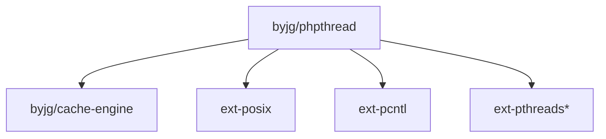

# PHP Thread

[](https://github.com/byjg/php-phpthread/actions/workflows/phpunit.yml)
[](http://opensource.byjg.com)
[](https://github.com/byjg/php-phpthread/)
[](https://opensource.byjg.com/opensource/licensing.html)
[](https://github.com/byjg/php-phpthread/releases/)

Threads made easy for PHP.

## General Concepts 

First of all it is important to understand that PHP is not a language that was designed to work with threads.

The PHP is a language that was designed to work with a request/response model. 
This means that the PHP is executed when a request is received and the PHP script is terminated 
when the response is sent to the client.

There are some native ways to work with threads in PHP or at least to simulate threads.

### Fork

The first way is to use the `fork` command. This command is available in most of the Linux/Unix systems.

The `fork` command will create a new process, clone of the parent process. It is not a Thread per se, because there are several
workarounds to make it work like a thread. 

We use the library [pcntl](https://www.php.net/manual/en/book.pcntl.php) to make it work.

### PHP ZTS

The second way is to use the ZTS (Zend Thread Safety) version of PHP. 
PHP is compiled with the option `--enable-zts` and not all distributions have a PHP package compiled with
this option. 

The ZTS version of PHP is a version that can be executed in a multi-thread environment.
That is the recommmeded option to work with threads in PHP in production environment.

## What is PHPThread library?

It is Polyfill Implementation of Threads in PHP. 
It abstracts the thread implementation we have installed (ZTS or Fork) and provide a common interface to work with threads.

## Disclaimer

```tip
Although this class works with a PHP without ZTS build 
we *do not* recommend use this library using pnctl in non-zts php for PRPODUCTION ENVIRONMENT

This is a playground library to test and develop your application using threads.
PHP is not a language designed to work with thread as node or java is.
```

## Features 

- [Thread](docs/thread.md)
- [Thread Pool](docs/threadpool.md)
- [Promisses (**experimental**)](docs/promisses.md)

## Limitations

### Fork Implementation and Thread return

When we clone a process we cannot have the return of the thread to the main process. 
However, to acomplish this we can use the `shmop` extension to share memory between processes.

Although it is possible in our implementation, **Do not return** big or complex data structures/objects,
in the return because it can cause a memory overflow.

### Promisses

Our implementation is a very limited version of Promisses, and it has only the `.then()` method without chainning.

Also, the return of the promisse uses the shared memory, and it has the same limitation of the Thread return. 

## Install

### Non-zts

* `pncntl` extension is required
* `shmop` extension is required

### ZTS

* `parallel` extension is required, to use full features
* `shmop` extension is required, to use Promisses

### Composer (Non-zts and ZTS)

Just type: `composer require "byjg/phpthread"`



